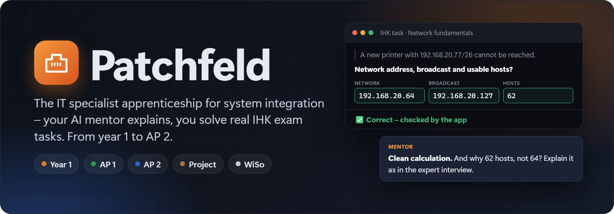
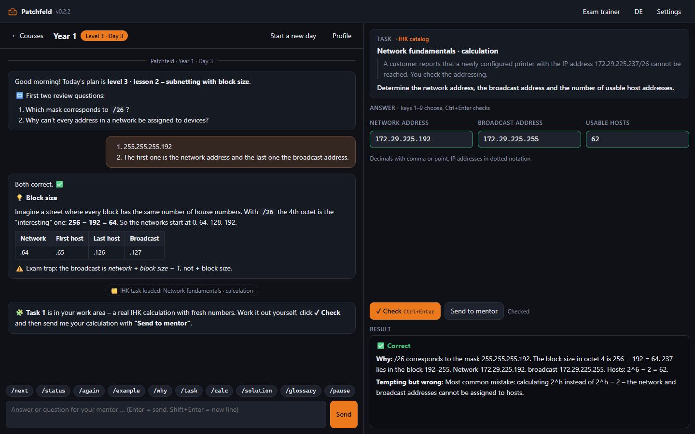
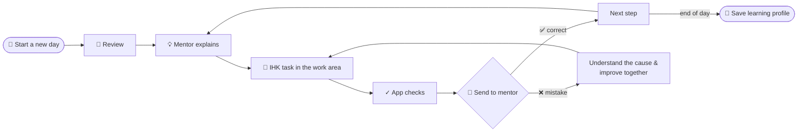
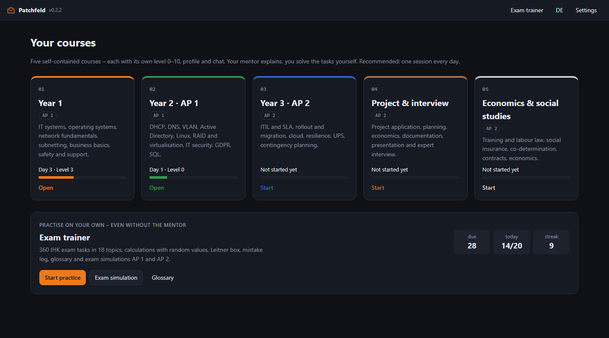
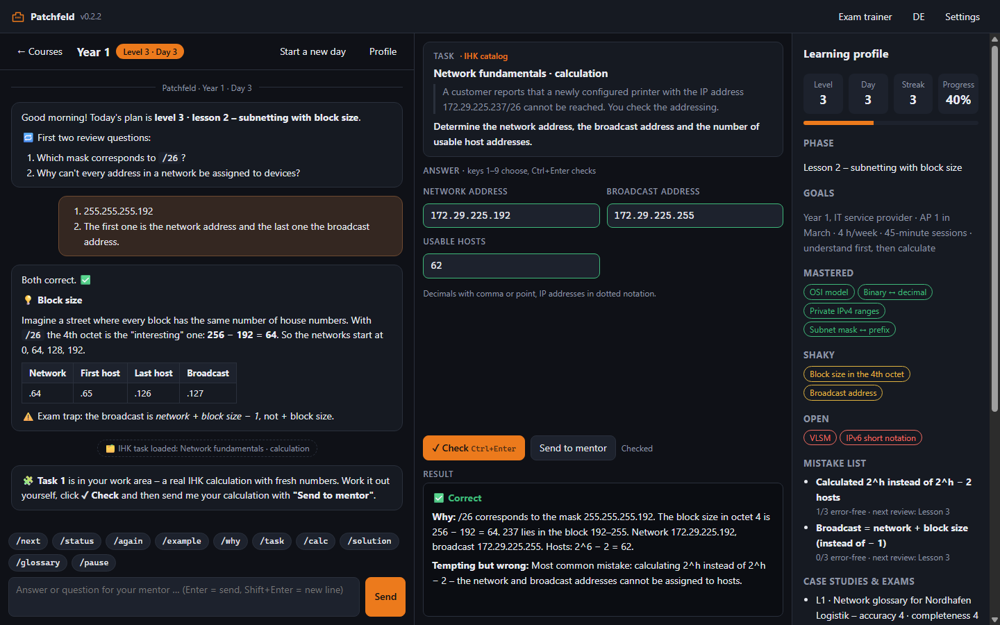
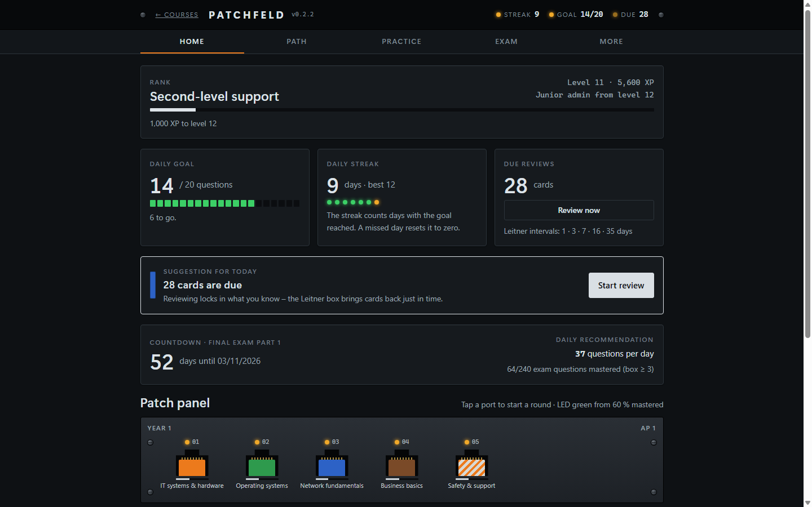
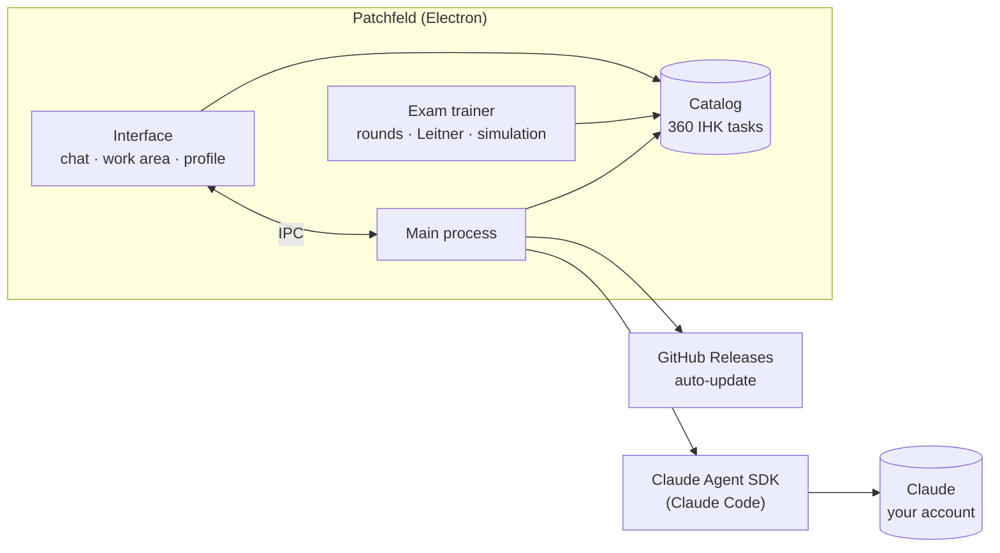

<p align="center">
  
</p>

<p align="center">
  <a href="README.md">🇩🇪 Deutsch</a> · 🇬🇧 English
</p>

<p align="center">
  <a href="https://github.com/MoinMornhart/patchfeld/releases/latest"></a>
  <a href="https://github.com/MoinMornhart/patchfeld/actions/workflows/test.yml"></a>
  
  
  
  
  
</p>

<p align="center">
  <a href="#download">Download</a> ·
  <a href="#how-a-learning-day-works">A learning day</a> ·
  <a href="#the-five-courses">Courses</a> ·
  <a href="#exam-trainer">Exam trainer</a> ·
  <a href="#screenshots">Screenshots</a> ·
  <a href="#for-developers">For developers</a>
</p>

<p align="center"><sub><b>Patchfeld version:</b> 0.2.3</sub></p>

---

**Patchfeld** is a learning app for Windows that accompanies you through the complete German apprenticeship as an **IT specialist for system integration** (Fachinformatiker/-in Systemintegration) – from year 1 to **final exam part 2**. An AI mentor **explains** every topic and you **do** it yourself right away: with real IHK exam tasks that the app checks instantly. One session every day, from **level 0** (no idea) to **level 10** (exam-ready, expert interview included).

<p align="center">
  
  <br><sub>Chat with the mentor · IHK task in the work area · automatic result</sub>
</p>

> [!TIP]
> The mentor **never gives you the solution right away**. They ask back, give nudges and tips – the full solution only comes when you explicitly type `/solution`. Calculations come with **fresh random values**, so you can never just memorise them.

## Download

<a href="https://github.com/MoinMornhart/patchfeld/releases/latest"></a>

1. Download `Patchfeld-Setup-x.y.z.exe` from the [releases page](https://github.com/MoinMornhart/patchfeld/releases/latest) and install it.
2. For the mentor: be signed in to **Claude Code** with your Claude account (Pro or Max) – e.g. through the Claude extension in VS Code. The **exam trainer** works without it.
3. Start Patchfeld, pick a course, click **"Start the first day"**.

From then on the app updates itself.

> [!NOTE]
> The app is not signed. Windows SmartScreen therefore asks on first start: **"More info" → "Run anyway"**.

## How a learning day works



1. **Start the day** – the mentor receives your saved learning profile and continues exactly where you stopped.
2. **Explain** – everyday analogy, the model company's problem (*Nordhafen Logistik*), minimal example, typical exam traps.
3. **Do** – the mentor loads tasks straight into the work area: real IHK tasks from the catalog (single choice, multiple choice, calculation, matching, ordering, open questions) or their own case studies.
4. **Check & discuss** – the app grades immediately, the mentor reviews your answer and phrases it the way the IHK expects.
5. **Save progress** – level, mistake list with reviews and glossary are saved automatically.

## The five courses

Each course is its own small app with its own level 0–10, learning profile, chat and archive. Recommended: in step with your apprenticeship.

| Course | Content | Exam |
|:----:|---------|:-------:|
|  | IT systems and hardware, operating systems, network fundamentals and subnetting, business basics, safety and support | AP 1 |
|  | DHCP, DNS, VLAN, routing, Active Directory, Linux, RAID and virtualisation, IT security, data protection, scripting and SQL | AP 1 |
|  | ITIL and SLA, migration and rollout, cloud and hybrid, resilience, UPS, contingency planning | AP 2 |
|  | Project application, planning, network plan, economics, documentation, presentation, expert interview | AP 2 |
|  | Training and labour law, social insurance, co-determination, contracts, economics | AP 2 |

## Exam trainer

For days without the mentor – or when your Claude limit is reached: a complete trainer with **360 IHK tasks in 18 topics**.

| | |
|---|---|
| 🎯 **Rounds** | 10 questions, 3 lives, XP, levels, ranks from apprentice to systems architect, combo multiplier, badges |
| 🗂️ **Leitner box** | five boxes, due after 1 · 3 · 7 · 16 · 35 days |
| 📕 **Mistake log** | every wrong answer lands there and can be repeated on purpose |
| 🧮 **Calculations** | subnetting, RAID, availability, UPS, transfer, depreciation, costing, network plan, weighted scoring – always new numbers |
| 📝 **Exam simulation** | AP 1 (30 questions, 90 min) and AP 2 (40 questions, 120 min) with an IHK grade and your three weakest topics |
| 📊 **Statistics** | learning path as a patch panel, daily goal, streak, exam countdown, hit rate per topic, time per question |
| 📖 **Glossary** | 118 terms and abbreviations, searchable |

## Screenshots

<table>
  <tr>
    <td width="50%"></td>
    <td width="50%"></td>
  </tr>
  <tr>
    <td align="center"><b>Home</b> – five courses and the exam trainer</td>
    <td align="center"><b>Learning profile</b> – level, mistake list, glossary</td>
  </tr>
  <tr>
    <td width="50%"></td>
    <td width="50%"></td>
  </tr>
  <tr>
    <td align="center"><b>Learning</b> – chat, IHK task, result</td>
    <td align="center"><b>Exam trainer</b> – learning path, daily goal, Leitner box</td>
  </tr>
</table>

<sub>The screenshots show a sample learning day; the task in them comes from the catalog and is really checked by the app when the images are generated.</sub>

## Features

| | |
|---|---|
| 🧑‍🏫 **Strict, fair mentor** | Fixed rules: help escalation instead of ready-made solutions, answer reviews with IHK wording, level exams with an 80 % threshold |
| 🧩 **Explaining and doing** | Every explanation ends in a task in the work area – you solve things yourself for more than half of the time |
| ✓ **Automatic checking** | Catalog tasks are graded instantly, with an explanation and the typical mistake |
| 🏢 **Model company** | A continuous case study, *Nordhafen Logistik GmbH* – or your own training company |
| 📈 **Learning profile** | Level, progress, mastered and shaky topics, mistake list with reviews, glossary |
| ⌨️ **Course commands** | `/next` `/status` `/again` `/example` `/why` `/task` `/calc` `/solution` `/glossary` `/pause` as buttons |
| 🌍 **German & English** | Interface, mentor and all 360 tasks in both languages |
| 🔄 **Automatic updates** | New versions arrive by themselves through GitHub Releases |
| 🔒 **Your account, your data** | Runs on your Claude account, no API key; the mentor has no access to files or the command line |

## How it works



- The mentor runs through the **Claude Agent SDK** with your existing Claude login. It gets the mentor rules from [`prompts/mentor.en.md`](prompts/mentor.en.md) and exactly **three tools**: load an IHK task from the catalog, load its own task and save the learning profile.
- Catalog tasks include the solution for the mentor – the learner only sees it after answering.
- Every learning day is its own session; earlier days are archived.
- Chats, profiles and settings are stored locally in `%APPDATA%\Patchfeld\patchfeld-data.json`, the trainer progress in the app's storage (export/import as JSON). Usage counts against your Claude plan's limits. For people without a Claude account there is an optional API key field in the settings.

## For developers

<details>
<summary><b>Run, test, build graphics</b></summary>

```powershell
npm install        # install dependencies
npm start          # start the app
npm test           # unit tests (mentor, catalog, translations, versions)
npm run check      # check the question catalog
npm run selftest   # start the app hidden and grade all 360 tasks
npm run graphics   # regenerate banner, app icon and screenshots
```

</details>

<details>
<summary><b>Versions, updates and releases</b></summary>

Versions follow a counter scheme: every update raises the last digit by 1. When a digit would exceed 9, it wraps to 0 and the digit to its left goes up by 1.

    0.0.1 → 0.0.2 → … → 0.0.9 → 0.1.0 → … → 0.9.9 → 1.0.0

```powershell
npm run bump -- --title "Short title" --de "Änderung 1" --en "Change 1"
npm run release
```

`bump` raises the version, adds the changes to [`CHANGELOG.md`](CHANGELOG.md) and [`CHANGELOG.en.md`](CHANGELOG.en.md), commits everything and tags `vX.Y.Z`. `release` pushes, creates the GitHub release, builds and uploads the installer and publishes it – installed apps pick up the update automatically.

</details>

<details>
<summary><b>Git rules</b></summary>

Every update is its own commit. The title always names the new version, the body lists the changes in German and English:

    [Patchfeld 0.2.3] Short title

    DE:
    - Änderung
    EN:
    - Change

</details>

<details>
<summary><b>Adding questions</b></summary>

All tasks live in [`src/renderer/catalog.js`](src/renderer/catalog.js); the format is described in [`docs/FRAGENFORMAT.md`](docs/FRAGENFORMAT.md). Every question needs a company situation, both languages, an explanation and the tempting mistake. `npm run check` and `npm test` verify structure, generators and that every task grades its own solution as correct.

</details>

<details>
<summary><b>Project structure</b></summary>

```
src/main/        Main process: window, mentor (Claude Agent SDK), catalog access, updates, storage
src/renderer/    Interface: courses and work area (index.html, app.js), exam trainer (trainer.*),
                 question catalog (catalog.js), task engine (engine.js), Markdown, translations
src/shared/      Course list and version logic
prompts/         Mentor instructions (German and English)
scripts/         bump.js, release.js, check.js, graphics.js
docs/            Graphics for this README and their templates, question format
test/            Unit tests (node --test)
```

</details>

---

<p align="center">
  <br>
  <sub>Built with Electron and the Claude Agent SDK – for everyone who takes their IHK exam seriously.</sub>
</p>
