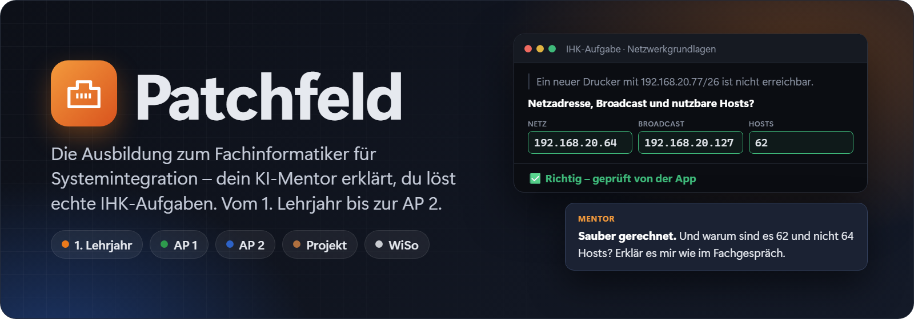
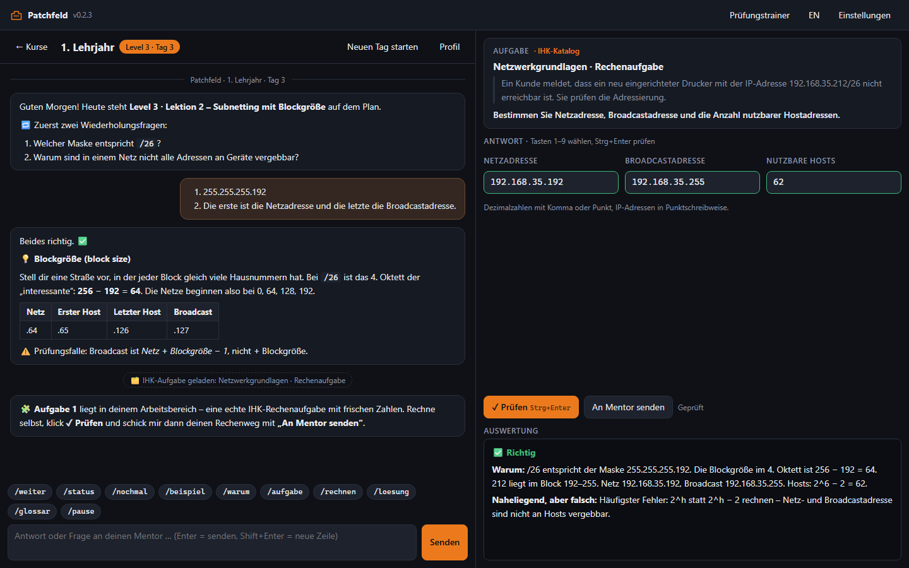
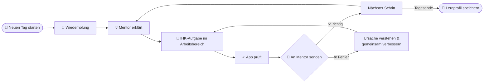
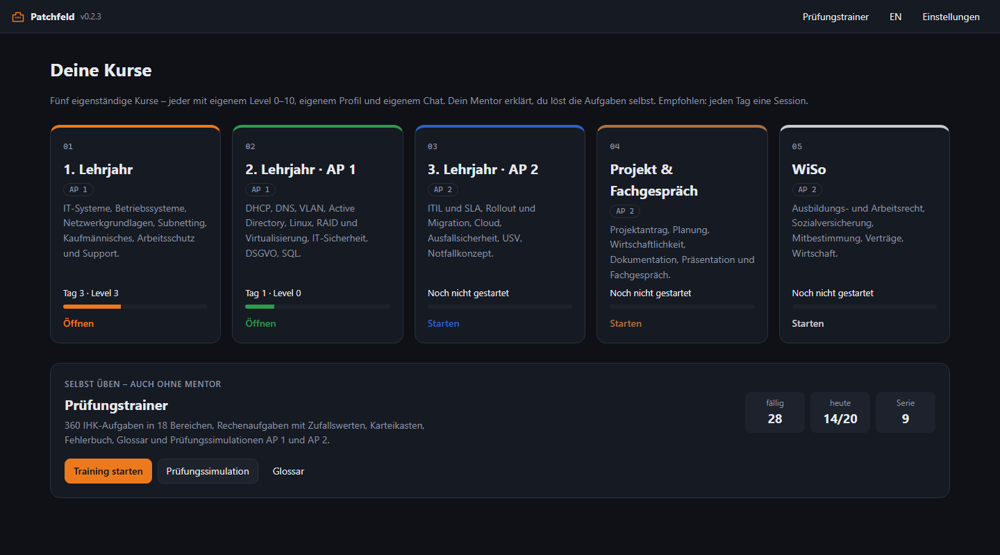
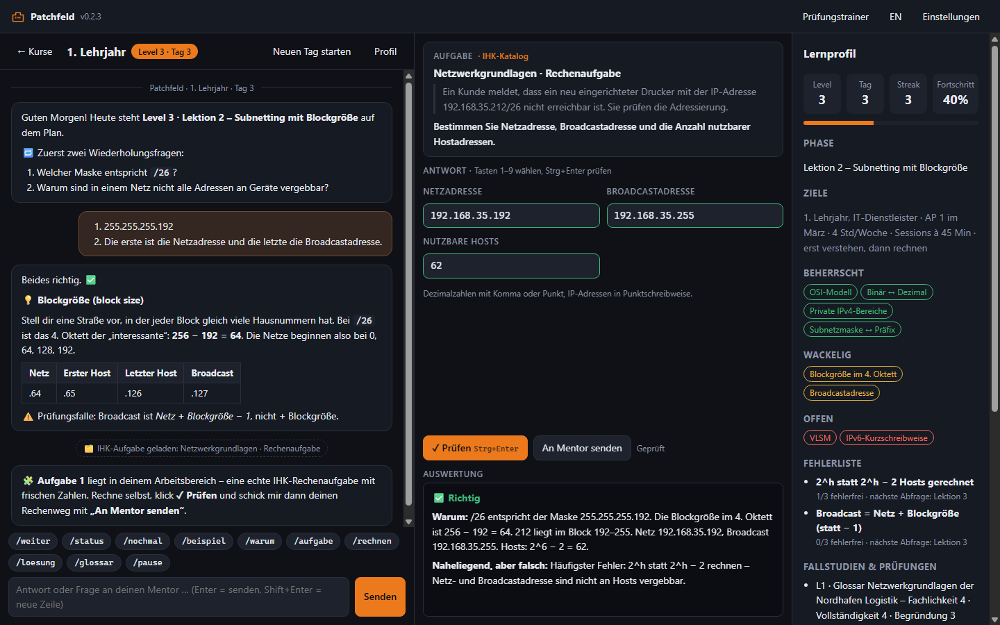
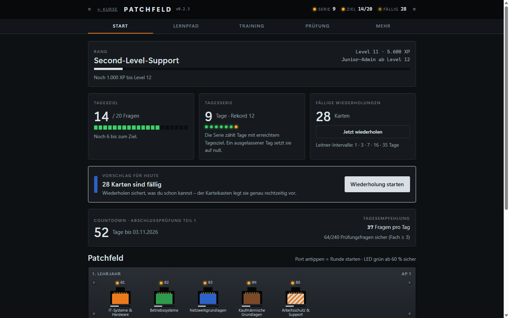
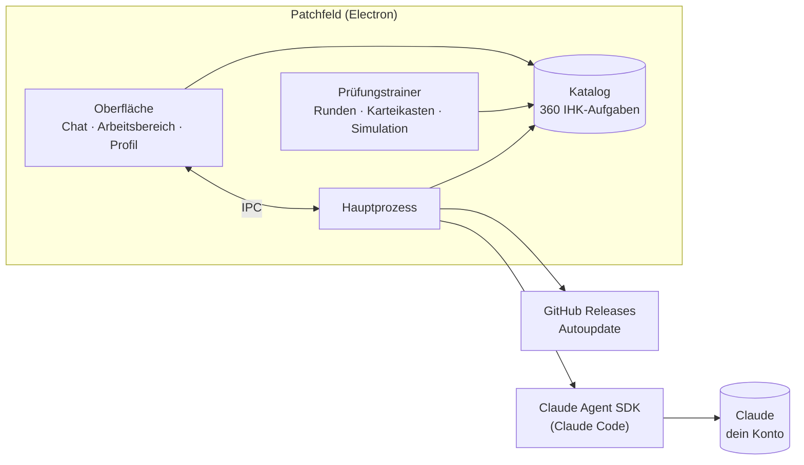

<p align="center">
  
</p>

<p align="center">
  🇩🇪 Deutsch · <a href="README.en.md">🇬🇧 English</a>
</p>

<p align="center">
  <a href="https://github.com/MoinMornhart/patchfeld/releases/latest"></a>
  <a href="https://github.com/MoinMornhart/patchfeld/actions/workflows/test.yml"></a>
  
  
  
  
  
</p>

<p align="center">
  <a href="#download">Download</a> ·
  <a href="#so-läuft-ein-lerntag">So läuft ein Lerntag</a> ·
  <a href="#die-fünf-kurse">Kurse</a> ·
  <a href="#prüfungstrainer">Prüfungstrainer</a> ·
  <a href="#screenshots">Screenshots</a> ·
  <a href="#für-entwickler">Für Entwickler</a>
</p>

<p align="center"><sub><b>Patchfeld-Version:</b> 0.2.4</sub></p>

---

**Patchfeld** ist eine Lern-App für Windows, die dich durch die komplette Ausbildung zum **Fachinformatiker für Systemintegration** begleitet – vom ersten Lehrjahr bis zur **Abschlussprüfung Teil 2**. Ein KI-Mentor **erklärt** dir jedes Thema, und du **machst** es sofort selbst: mit echten IHK-Aufgaben, die die App direkt prüft. Jeden Tag eine Session von **Level 0** (keine Ahnung) bis **Level 10** (prüfungsreif, Fachgespräch inklusive).

<p align="center">
  
  <br><sub>Chat mit dem Mentor · IHK-Aufgabe im Arbeitsbereich · automatische Auswertung</sub>
</p>

> [!TIP]
> Der Mentor gibt dir **nie sofort die Lösung**. Er fragt nach, gibt Denkanstöße und Tipps – die fertige Lösung gibt es nur, wenn du ausdrücklich `/loesung` schreibst. Rechenaufgaben kommen mit **frischen Zufallswerten**, sie sitzen also nie auswendig.

## Download

<a href="https://github.com/MoinMornhart/patchfeld/releases/latest"></a>

1. `Patchfeld-Setup-x.y.z.exe` von der [Releases-Seite](https://github.com/MoinMornhart/patchfeld/releases/latest) laden und installieren.
2. Für den Mentor: in **Claude Code** mit deinem Claude-Konto (Pro oder Max) angemeldet sein – z. B. über die Claude-Erweiterung in VS Code. Der **Prüfungstrainer** funktioniert auch ohne.
3. Patchfeld starten, Kurs wählen, **„Ersten Tag starten“**.

Ab dann aktualisiert sich die App selbst.

> [!NOTE]
> Die App ist nicht signiert. Windows SmartScreen fragt deshalb beim ersten Start nach: **„Weitere Informationen“ → „Trotzdem ausführen“**.

## So läuft ein Lerntag



1. **Tag starten** – der Mentor bekommt dein gespeichertes Lernprofil und setzt genau dort an, wo du aufgehört hast.
2. **Erklären** – Alltagsvergleich, Problem der Musterfirma *Nordhafen Logistik*, Minimalbeispiel, typische Prüfungsfallen.
3. **Machen** – der Mentor lädt Aufgaben direkt in den Arbeitsbereich: echte IHK-Aufgaben aus dem Katalog (Single Choice, Mehrfachauswahl, Rechnen, Zuordnen, Reihenfolge, offene Fragen) oder eigene Fallstudien.
4. **Prüfen & besprechen** – die App bewertet sofort, der Mentor bespricht deine Antwort im Review-Format und formuliert sie prüfungsreif.
5. **Fortschritt sichern** – Level, Fehlerliste mit Wiederholungen und Glossar werden automatisch gespeichert.

## Die fünf Kurse

Jeder Kurs ist eine eigene kleine App mit eigenem Level 0–10, Lernprofil, Chat und Archiv. Empfohlen: im Takt deiner Ausbildung.

| Kurs | Inhalte | Prüfung |
|:----:|---------|:-------:|
|  | IT-Systeme und Hardware, Betriebssysteme, Netzwerkgrundlagen und Subnetting, kaufmännische Grundlagen, Arbeitsschutz und Support | AP 1 |
|  | DHCP, DNS, VLAN, Routing, Active Directory, Linux, RAID und Virtualisierung, IT-Sicherheit, Datenschutz, Skripting und SQL | AP 1 |
|  | ITIL und SLA, Migration und Rollout, Cloud und Hybrid, Ausfallsicherheit, USV, Notfallkonzept | AP 2 |
|  | Projektantrag, Planung, Netzplan, Wirtschaftlichkeit, Dokumentation, Präsentation, Fachgespräch | AP 2 |
|  | Ausbildungs- und Arbeitsrecht, Sozialversicherung, Mitbestimmung, Verträge, Wirtschaft | AP 2 |

## Prüfungstrainer

Für die Tage ohne Mentor – oder wenn das Claude-Limit erreicht ist: ein kompletter Trainer mit **360 IHK-Aufgaben in 18 Bereichen**.

| | |
|---|---|
| 🎯 **Runden** | 10 Fragen, 3 Leben, XP, Level, Ränge vom Azubi bis zum Systemarchitekten, Kombo-Multiplikator, Abzeichen |
| 🗂️ **Karteikasten** | Leitner-System mit fünf Fächern, Wiedervorlage nach 1 · 3 · 7 · 16 · 35 Tagen |
| 📕 **Fehlerbuch** | jede falsche Antwort landet dort und kann gezielt wiederholt werden |
| 🧮 **Rechenaufgaben** | Subnetting, RAID, Verfügbarkeit, USV, Übertragung, AfA, Kalkulation, Netzplan, Nutzwert – immer neue Zahlen |
| 📝 **Prüfungssimulation** | AP 1 (30 Fragen, 90 min) und AP 2 (40 Fragen, 120 min) mit Note nach IHK-Schlüssel und den drei schwächsten Bereichen |
| 📊 **Statistik** | Lernpfad als Patchfeld, Tagesziel, Serie, Prüfungscountdown, Trefferquote je Bereich, Zeit pro Frage |
| 📖 **Glossar** | 118 Fachbegriffe und Abkürzungen, durchsuchbar |

## Screenshots

<table>
  <tr>
    <td width="50%"></td>
    <td width="50%"></td>
  </tr>
  <tr>
    <td align="center"><b>Startseite</b> – fünf Kurse und der Prüfungstrainer</td>
    <td align="center"><b>Lernprofil</b> – Level, Fehlerliste, Glossar</td>
  </tr>
  <tr>
    <td width="50%"></td>
    <td width="50%"></td>
  </tr>
  <tr>
    <td align="center"><b>Lernen</b> – Chat, IHK-Aufgabe, Auswertung</td>
    <td align="center"><b>Prüfungstrainer</b> – Lernpfad, Tagesziel, Karteikasten</td>
  </tr>
</table>

<sub>Die Screenshots zeigen einen Beispiel-Lerntag; die Aufgabe darin stammt aus dem Katalog und wird beim Erstellen der Bilder wirklich von der App geprüft.</sub>

## Funktionen

| | |
|---|---|
| 🧑‍🏫 **Strenger, fairer Mentor** | Feste Regeln: Hilfe-Eskalation statt fertiger Lösungen, Antwort-Review mit IHK-Formulierung, Levelprüfungen mit 80 %-Grenze |
| 🧩 **Erklären und Machen** | Jede Erklärung endet in einer Aufgabe im Arbeitsbereich – mehr als die Hälfte der Zeit löst du selbst |
| ✓ **Automatische Prüfung** | Katalogaufgaben werden sofort bewertet, mit Erklärung und dem typischen Denkfehler |
| 🏢 **Musterfirma** | Durchgängiges Fallbeispiel *Nordhafen Logistik GmbH* – oder dein eigener Ausbildungsbetrieb |
| 📈 **Lernprofil** | Level, Fortschritt, beherrschte und wackelige Themen, Fehlerliste mit Wiederholungen, Glossar |
| ⌨️ **Kursbefehle** | `/weiter` `/status` `/nochmal` `/beispiel` `/warum` `/aufgabe` `/rechnen` `/loesung` `/glossar` `/pause` als Knöpfe |
| 🌍 **Deutsch & Englisch** | Oberfläche, Mentor und alle 360 Aufgaben in beiden Sprachen |
| 🔄 **Automatische Updates** | Neue Versionen kommen über GitHub Releases von selbst |
| 🔒 **Dein Konto, deine Daten** | Läuft über dein Claude-Konto, kein API-Key; der Mentor hat keinen Zugriff auf Dateien oder die Kommandozeile |

## Wie es funktioniert



- Der Mentor läuft über das **Claude Agent SDK** mit deinem bestehenden Claude-Login. Er bekommt die Mentor-Regeln aus [`prompts/mentor.de.md`](prompts/mentor.de.md) und genau **drei Werkzeuge**: IHK-Aufgabe aus dem Katalog laden, eigene Aufgabe laden und Lernprofil speichern.
- Katalogaufgaben enthalten für den Mentor die Lösung – der Lernende sieht sie erst nach seiner Antwort.
- Jeder Lerntag ist eine eigene Sitzung; frühere Tage werden archiviert.
- Chats, Profile und Einstellungen liegen lokal in `%APPDATA%\Patchfeld\patchfeld-data.json`, der Trainer-Fortschritt im App-Speicher (Export/Import als JSON). Die Nutzung zählt gegen die Limits deines Claude-Abos. Für Personen ohne Claude-Konto gibt es in den Einstellungen ein optionales Feld für einen API-Key.

## Für Entwickler

<details>
<summary><b>Starten, testen, Grafiken bauen</b></summary>

```powershell
npm install        # Abhängigkeiten installieren
npm start          # App starten
npm test           # Unit-Tests (Mentor, Katalog, Übersetzungen, Versionen)
npm run check      # Fragenkatalog prüfen
npm run selftest   # App unsichtbar starten und alle 360 Aufgaben durchbewerten
npm run graphics   # Banner, App-Icon und Screenshots neu erzeugen
```

</details>

<details>
<summary><b>Versionen, Updates und Releases</b></summary>

Versionen folgen dem Zähler-System: Jede Aktualisierung erhöht die letzte Stelle um 1. Wird eine Stelle größer als 9, springt sie auf 0 und die Stelle links davon wird um 1 erhöht.

    0.0.1 → 0.0.2 → … → 0.0.9 → 0.1.0 → … → 0.9.9 → 1.0.0

```powershell
npm run bump -- --title "Kurzer Titel" --de "Änderung 1" --en "Change 1"
npm run release
```

`bump` erhöht die Version, trägt die Änderungen in [`CHANGELOG.md`](CHANGELOG.md) und [`CHANGELOG.en.md`](CHANGELOG.en.md) ein, committet alles und setzt den Tag `vX.Y.Z`. `release` pusht, legt den GitHub-Release an, baut den Installer, lädt ihn hoch und veröffentlicht – installierte Apps holen sich das Update automatisch.

</details>

<details>
<summary><b>Git-Regeln</b></summary>

Jede Aktualisierung ist ein eigener Commit. Der Titel nennt immer die neue Version, der Text listet die Änderungen auf Deutsch und Englisch:

    [Patchfeld 0.2.3] Kurzer Titel

    DE:
    - Änderung
    EN:
    - Change

</details>

<details>
<summary><b>Fragen ergänzen</b></summary>

Alle Aufgaben stehen in [`src/renderer/catalog.js`](src/renderer/catalog.js), das Format ist in [`docs/FRAGENFORMAT.md`](docs/FRAGENFORMAT.md) beschrieben. Jede Frage braucht eine betriebliche Situation, beide Sprachen, eine Erklärung und den naheliegenden Fehler. `npm run check` und `npm test` prüfen Struktur, Generatoren und dass jede Aufgabe ihre eigene Lösung als richtig bewertet.

</details>

<details>
<summary><b>Projektstruktur</b></summary>

```
src/main/        Hauptprozess: Fenster, Mentor (Claude Agent SDK), Katalogzugriff, Updates, Speicher
src/renderer/    Oberfläche: Kurse und Arbeitsbereich (index.html, app.js), Prüfungstrainer (trainer.*),
                 Fragenkatalog (catalog.js), Aufgaben-Engine (engine.js), Markdown, Übersetzungen
src/shared/      Kursliste und Versionslogik
prompts/         Mentor-Anweisungen (Deutsch und Englisch)
scripts/         bump.js, release.js, check.js, graphics.js
docs/            Grafiken für dieses README und ihre Vorlagen, Fragenformat
test/            Unit-Tests (node --test)
```

</details>

---

<p align="center">
  <br>
  <sub>Gebaut mit Electron und dem Claude Agent SDK – für alle, die ihre IHK-Prüfung ernst nehmen.</sub>
</p>
